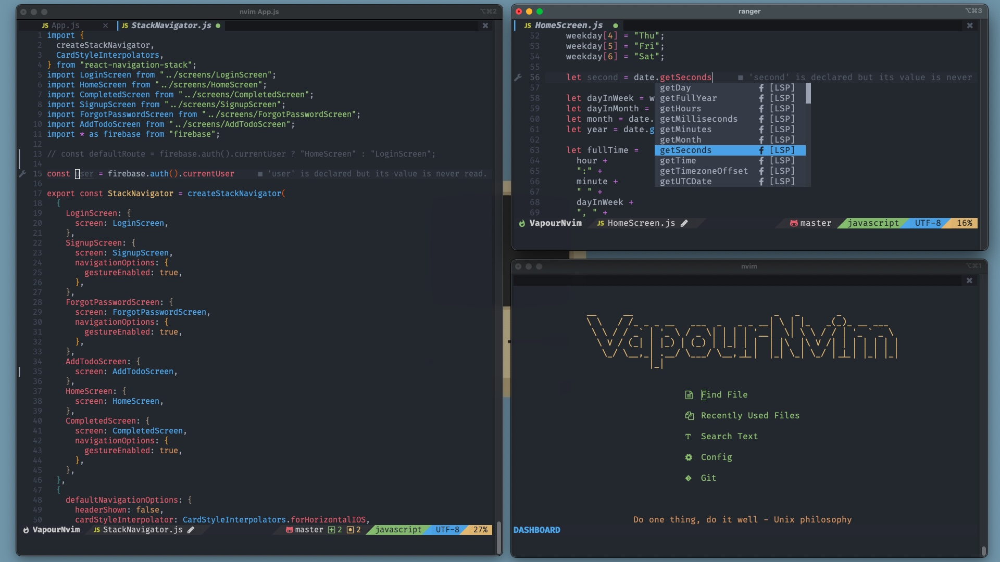

<div align="center">
	<a href="https://github.com/hackorum/VapourNvim/#features">✨ Features</a>
  <span> • </span>
	<a href="https://github.com/hackorum/VapourNvim/#installation">📦 Installation</a>
  <span> • </span>
	<a href="https://github.com/hackorum/VapourNvim/wiki">📚 Wiki</a>
  <span> • </span>
	<a href="https://github.com/hackorum/VapourNvim/wiki/Screenshots">📷 Screenshots</a>
  <p></p>
</div>




## Introduction

The goal of this project is to simply *get work done* quickly.

This project is built to be:
* **Functional**. The core of an ideal IDE is functionality. If there is anything you want to add, please consider contributing
* **Minimal**. Too many plugins can affect startup time. VapourNvim loads as smooth as butter with an optimum amount of plugins

## Features

* A very elegant and clean look to the editor
* An extensible package management system
* Written in an efficient programming language
* Great support for version control
* Code completion
* Language support(LSP)
* Autoformatting
* Faster navigation with telescope and hop.nvim
* Better syntax highlighting with treesitter
* Terminal integration


## Requirements

* [The Latest and Greatest Neovim](https://github.com/neovim/neovim/releases/tag/nightly) - Required - For lua configuration
* [NodeJS](https://nodejs.org) - Required - For LSP
* [Lazygit](https://github.com/jesseduffield/lazygit) - Optional - For git integration
* [Pandoc](https://github.com/jgm/pandoc) - Optional - For markdown preview

## Installation

Make sure you have curl and bash installed before you run this script.

```bash
curl -s https://raw.githubusercontent.com/hackorum/VapourNvim/main/install.sh | bash -s
```

## Manual Installation
```
git clone https://github.com/hackorum/VapourNvim ~/.config/nvim
nvim +PackerSync
```

## After Installation
Please read the [wiki](https://github.com/hackorum/VapourNvim/wiki) for [Keybindings](https://github.com/hackorum/VapourNvim/wiki/Keybindings), [Language Servers](https://github.com/hackorum/VapourNvim/wiki/Language-Servers), [Plugins](https://github.com/hackorum/VapourNvim/wiki/Plugins) and [Screenshots](https://github.com/hackorum/VapourNvim/wiki/Screenshots).

## Contributing

Pull requests are welcome. For major changes, please open an issue first to discuss what you would like to change.

## License

This project is licensed under the GPL-3.0 license.
